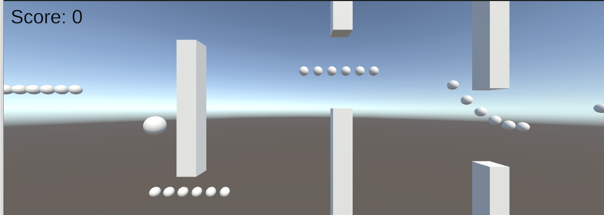

# balloon-game
Follow along with me on the dev process for this flappy bird inspired mobile game! Built in Unity 2022.3

## Minimum Viable Product (MVP) Update 1
*08/01/2024*

**What's New?**

The game is playable! Current features include:

- Placeholder model meshes
- Player movement with the arrow keys / WASD
- Random obstacle and coin pattern generation
- Game over conditions
- Score increase on coin collection

**What's Next?**

Next on the list is prettifying the prototype so that it's more fun to play, including:

- Creating 3D models for the hot air balloon, coins, and obstacles
- Adding a scenic background
- Adding music and sound effects

Stay tuned for more updates!
